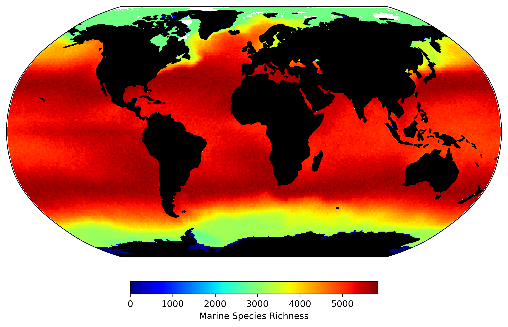

<!--
**ruiying-ocean/ruiying-ocean** is a ✨ _special_ ✨ repository because its `README.md` (this file) appears on your GitHub profile.
-->

WELCOME to my Github page 😄. My name is Rui Ying (Chinese: **应锐**), I'm a final year PhD student at the University of Bristol, UK. My research interests are marine ecology, climate change and biogeochemical cycle. The following map easily explains why (a modelled species diversity using METAL theory). 

    

I want to understand the fundamental regulation of marine ecology and simulate the realistic dynamic in a theoretical world. I also hope to understand the consequences of these biological/ecological processes, such as the transfering of energy and matters from one position to the other. These questions will determine our knowledge of the global climate, ocean environment, and food supply in the future (and make me happy).

:computer:  <ins> In my PhD, I use a Earth System Model of Intermediate Complexity ([cGENIE](https://github.com/derpycode/cgenie.muffin)) and observed planktic foraminifer data to answer these questions  </ins>. Planktic foraminifer is an intersting group of zooplankton (tiny animal living in the water) with inorganic shell (CaCO3). These shells provide the most abudant microfossil samples in the world and are widely used to reconstruct temperature in the past.

:star2: I have developed the ForamEcoGENIE model, i.e., adding more planktic foraminifer groups into cGENIE model. A Python Package, [cgeniepy](https://github.com/ruiying-ocean/cgeniepy) is also developed to facilitate analysis and visualisation. Recently, I also submitted a new manuscript regarding foraminifera thermal niche in different ages, which can be found in the below preprint. 

#### Other links :link:
[Google Scholar](https://scholar.google.com/citations?user=1QNR-nEAAAAJ&hl=en)
[Twitter](https://twitter.com/YingRui17)

#### Latest Publication 📖
Ying, R., Monteiro, F. M., Wilson, J. D., and Schmidt, D. N.: Marine zooplankton acclimated to geological warming while facing limits by the next century, EarthArxiv (preprint), https://doi.org/10.31223/X5D10G, 2023.

Ying, R., Monteiro, F. M., Wilson, J. D., and Schmidt, D. N.: ForamEcoGEnIE 2.0: incorporating symbiosis and spine traits into a trait-based global planktic foraminiferal model, Geosci. Model Dev., 16, 813–832, https://doi.org/10.5194/gmd-16-813-2023, 2023. 
